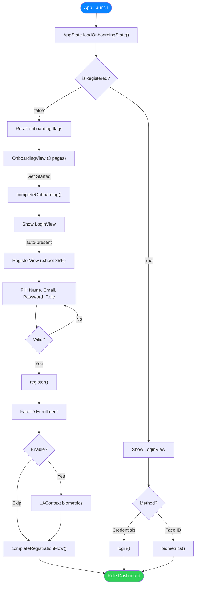
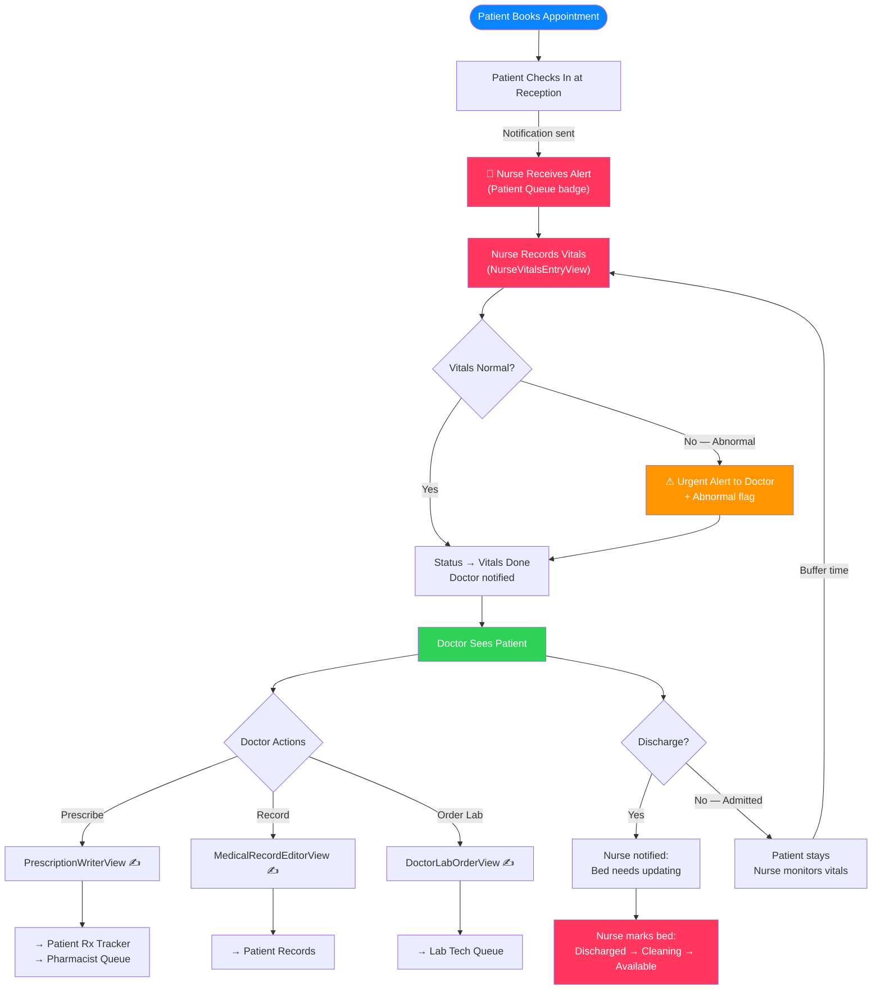
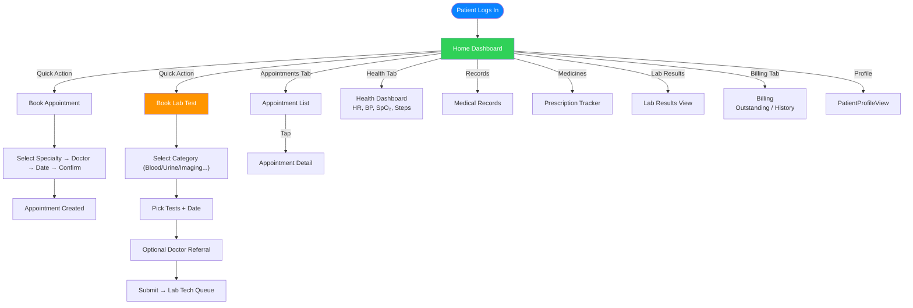
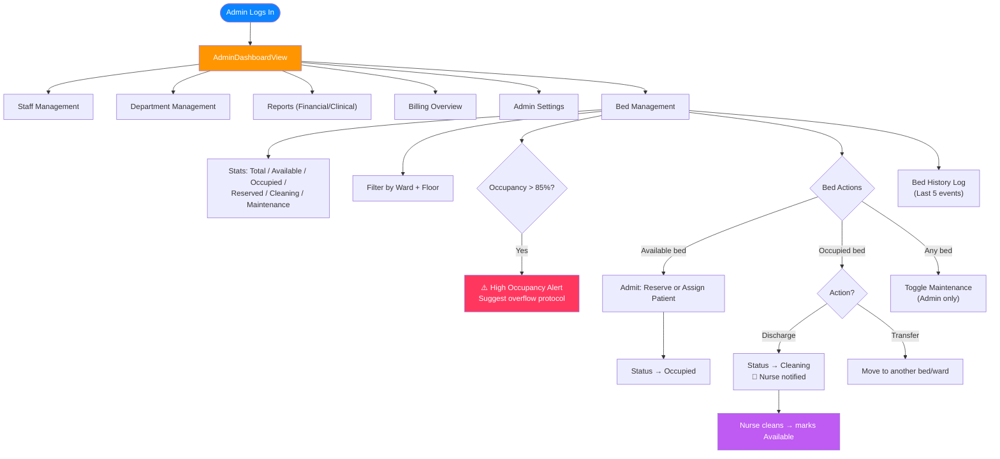
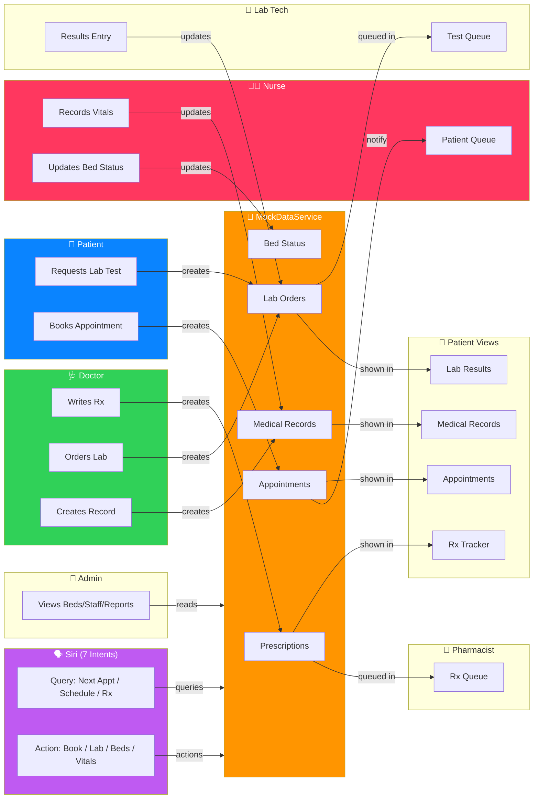
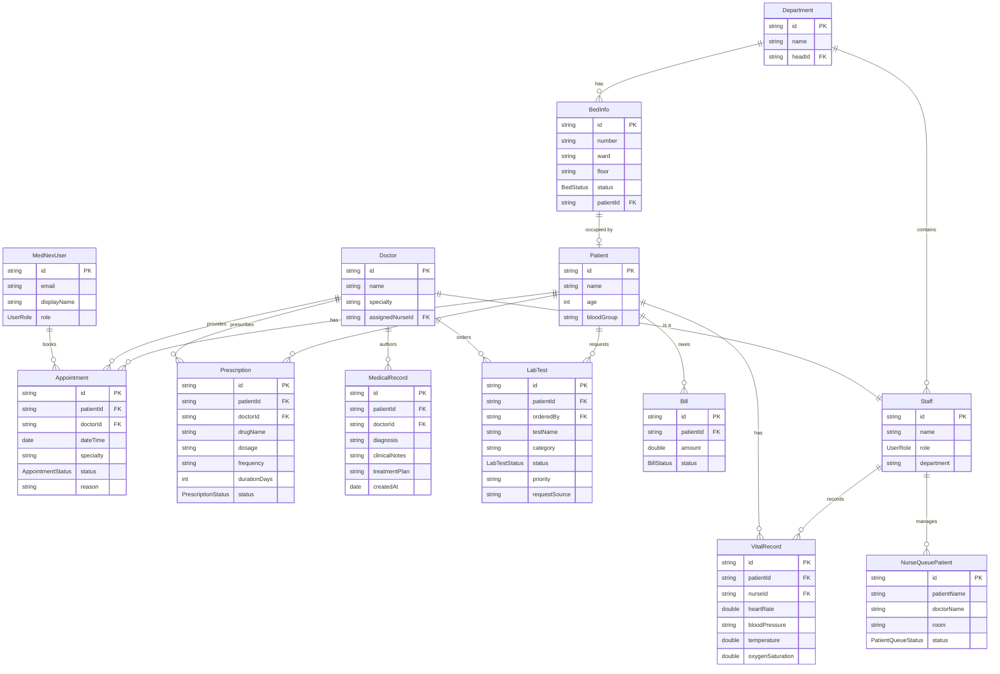

# MedNex — System Architecture & Workflow Diagrams

---

## 1. System Architecture (Layered)

```mermaid
graph TD
    subgraph EntryPoint["🚀 App Entry"]
        MNA["MedNexApp"]
        CV["ContentView"]
    end

    subgraph CoreLayer["🔐 Core Layer"]
        OB["OnboardingView"]
        LV["LoginView"]
        RV["RegisterView"]
        AVM["AuthViewModel"]
        AS["AuthService"]
        APP["AppState"]
        RR["RoleRouter"]
    end

    subgraph FeatureLayer["📱 Feature Layer — Role-Based Modules"]
        subgraph PatientModule["Patient Module"]
            PTab["PatientTabView"]
            PHome["PatientHomeView"]
            AList["AppointmentListView"]
            ABook["AppointmentBookingView"]
            ADet["AppointmentDetailView"]
            HDash["HealthDashboardView"]
            MRec["MedicalRecordsView"]
            PRx["PrescriptionTrackerView"]
            LRes["LabResultsView"]
            PLab["PatientLabRequestView"]
            PBill["BillingView"]
            PProf["PatientProfileView"]
        end

        subgraph DoctorModule["Doctor Module"]
            DTab["DoctorTabView"]
            DDash["DoctorDashboardView"]
            DSch["DoctorScheduleView"]
            DPat["DoctorPatientsView"]
            DLab["DoctorLabOrderView"]
            DRx["PrescriptionWriterView"]
            DMR["MedicalRecordEditorView"]
            DProf["DoctorProfileView"]
        end

        subgraph AdminModule["Admin Module"]
            ATab["AdminTabView"]
            ADash["AdminDashboardView"]
            AStaff["StaffManagementView"]
            ARep["AdminReportsView"]
            ABill["BillingOverviewView"]
            ADept["DepartmentManagementView"]
            ABed["BedManagementView"]
            AInv["AdminInventoryView"]
            ASet["AdminSettingsView"]
        end

        subgraph NurseModule["Nurse Module"]
            NTab["NurseTabView"]
            NDash["NurseDashboardView"]
            NQueue["NursePatientQueueView"]
            NVit["NurseVitalsEntryView"]
            NBed["NurseBedUpdateView"]
            NTask["NurseTasksView"]
        end

        subgraph LabModule["Lab Tech Module"]
            LTab["LabTechTabView"]
        end

        subgraph PharmModule["Pharmacist Module"]
            PhTab["PharmacistTabView"]
        end

        SProf["StaffProfileView"]
    end

    subgraph SharedLayer["🧱 Shared Layer"]
        subgraph UIComponents["UI Components"]
            GC["GlassCard"]
            SC["StatCard"]
            SB["StatusBadge"]
            AV["AvatarView"]
        end

        subgraph DesignSystem["Design System"]
            Theme["MedNexTheme"]
            Glass["GlassStyles"]
            Haptic["HapticManager"]
        end

        subgraph DataModels["Data Models"]
            MUser["MedNexUser + UserRole"]
            MAppt["Appointment"]
            MRx["Prescription"]
            MLab["LabTest"]
            MBill["Bill"]
            MDept["Department"]
            MVit["VitalRecord"]
        end

        MockDS["MockDataService"]
    end

    subgraph IntelligenceLayer["🧠 Apple Intelligence Layer"]
        subgraph QueryIntents["Query Intents"]
            NAI["NextAppointmentIntent"]
            TSI["TodayScheduleIntent"]
            API["ActivePrescriptionsIntent"]
        end
        subgraph ActionIntents["Actionable Intents"]
            BAI["BookAppointmentIntent"]
            CBAI["CheckBedAvailabilityIntent"]
            RLTI["RequestLabTestIntent"]
            VUI["VitalsUpdateIntent"]
        end
        Short["MedNexShortcuts"]
        WT["Writing Tools"]
    end

    %% Entry flow
    MNA -->|"creates"| CV
    CV -->|"manages"| APP
    CV -->|"!onboarded"| OB
    CV -->|"!authenticated"| LV
    CV -->|"first-time"| RV
    LV -->|"uses"| AVM
    RV -->|"uses"| AVM
    AVM -->|"calls"| AS
    AVM -->|"updates"| APP
    CV -->|"authenticated"| RR

    %% Role routing
    RR -->|"patient"| PTab
    RR -->|"doctor"| DTab
    RR -->|"admin"| ATab
    RR -->|"nurse"| NTab
    RR -->|"labTech"| LTab
    RR -->|"pharmacist"| PhTab

    %% Patient tabs
    PTab --> PHome
    PTab --> AList
    PTab --> HDash
    PTab --> PBill
    PHome -->|"Book"| ABook
    PHome -->|"Lab Test"| PLab
    AList -->|"tap"| ADet

    %% Doctor tabs
    DTab --> DDash
    DTab --> DSch
    DTab --> DPat
    DTab --> DLab
    DTab --> DProf
    DPat --> DRx
    DPat --> DMR

    %% Admin tabs
    ATab --> ADash
    ATab --> AStaff
    ATab --> ARep
    ATab --> ABill
    ATab --> ASet
    ADash --> ADept
    ADash --> ABed
    ADash --> AInv

    %% Nurse tabs
    NTab --> NDash
    NTab --> NQueue
    NTab --> NVit
    NTab --> NBed
    NTab --> NTask

    %% Shared dependencies
    FeatureLayer -->|"uses"| UIComponents
    UIComponents -->|"styled by"| DesignSystem
    FeatureLayer -->|"reads"| MockDS
    MockDS -->|"returns"| DataModels

    %% Intelligence
    Short -->|"registers"| QueryIntents
    Short -->|"registers"| ActionIntents
    QueryIntents -->|"queries"| MockDS
    ActionIntents -->|"queries"| MockDS
    DRx -->|"uses"| WT
    DMR -->|"uses"| WT

    style EntryPoint fill:#0A84FF,stroke:#0A84FF,color:#fff
    style CoreLayer fill:#BF5AF2,stroke:#BF5AF2,color:#fff
    style FeatureLayer fill:#30D158,stroke:#30D158,color:#fff
    style SharedLayer fill:#FF9500,stroke:#FF9500,color:#fff
    style IntelligenceLayer fill:#FF375F,stroke:#FF375F,color:#fff
```

---

## 2. First-Launch & Authentication Flow

---

## 3. Role-Based Navigation Map

```mermaid
flowchart TD
    RR["RoleRouter"] --> P{"patient"}
    RR --> D{"doctor"}
    RR --> A{"admin"}
    RR --> N{"nurse"}
    RR --> L{"labTech"}
    RR --> PH{"pharmacist"}

    P --> PT["PatientTabView"]
    PT --> PT1["🏠 Home"]
    PT --> PT2["📅 Appointments"]
    PT --> PT3["❤️ Health"]
    PT --> PT4["💳 Billing"]
    PT1 --> PQA1["→ Book Appointment"]
    PT1 --> PQA2["→ Book Lab Test"]
    PT1 --> PQA3["→ Records"]
    PT1 --> PQA4["→ Medicines"]
    PT2 --> ADET["→ Appointment Detail"]

    D --> DT["DoctorTabView"]
    DT --> DT1["📊 Dashboard"]
    DT --> DT2["📅 Schedule"]
    DT --> DT3["👥 Patients"]
    DT --> DT4["🧪 Lab Orders"]
    DT --> DT5["⋯ Profile"]
    DT3 --> DRX["→ Prescription Writer ✍️"]
    DT3 --> DMR["→ Medical Record Editor ✍️"]

    A --> AT["AdminTabView"]
    AT --> AT1["📊 Dashboard"]
    AT --> AT2["👥 Staff"]
    AT --> AT3["📈 Reports"]
    AT --> AT4["💳 Billing"]
    AT --> AT5["⋯ Settings"]
    AT1 --> ADEPT["→ Departments"]
    AT1 --> ABED["→ Bed Management"]
    AT1 --> AINV["→ Inventory"]

    N --> NT["NurseTabView"]
    NT --> NT1["📋 Dashboard"]
    NT --> NT2["👥 Patients"]
    NT --> NT3["💓 Vitals"]
    NT --> NT4["🛏️ Beds"]
    NT --> NT5["✅ Tasks"]

    L --> LT["LabTechTabView"]
    LT --> LT1["🧪 Queue"]
    LT --> LT2["📄 Results"]

    PH --> PHT["PharmacistTabView"]
    PHT --> PHT1["💊 Orders"]
    PHT --> PHT2["📦 Inventory"]

    style RR fill:#BF5AF2,color:#fff
    style PT fill:#0A84FF,color:#fff
    style DT fill:#30D158,color:#fff
    style AT fill:#FF9500,color:#fff
    style NT fill:#FF375F,color:#fff
    style LT fill:#5E5CE6,color:#fff
    style PHT fill:#FF6482,color:#fff
```

---

## 4. Doctor → Patient → Nurse → Doctor → Patient Flow

---

## 5. Patient Complete Workflow

---

## 6. Admin Operations — Bed Management Focus

---

## 7. Cross-Role Data Flow

---

## 8. Data Model — Entity Relationships

