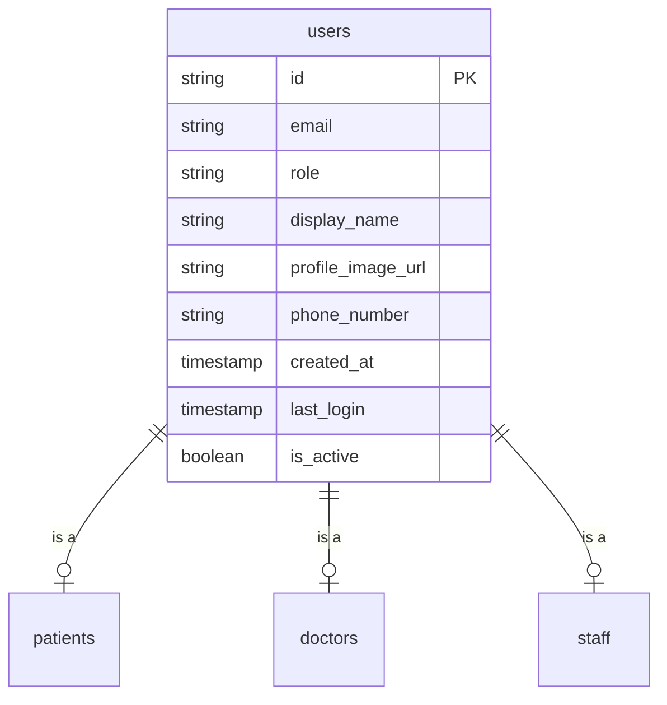
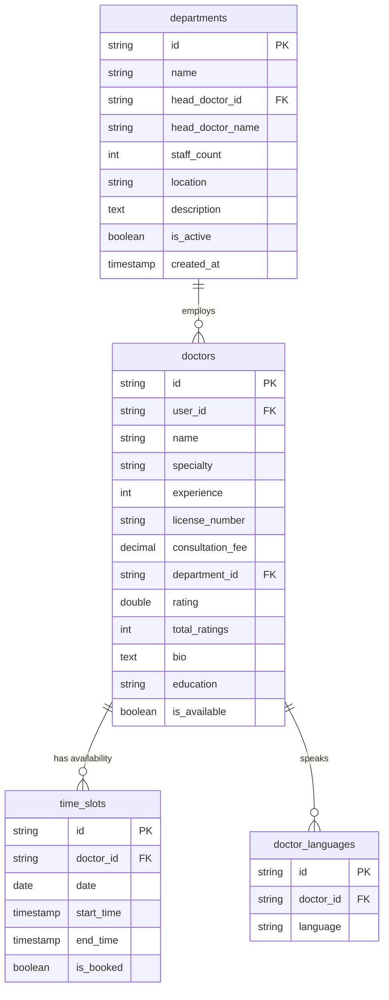
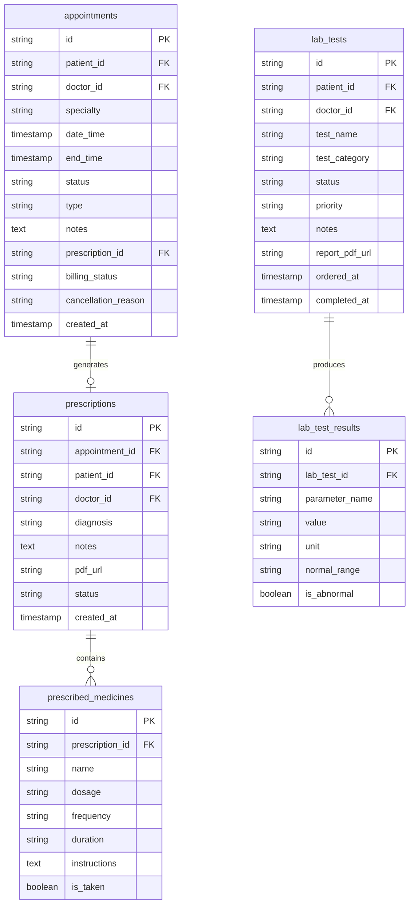
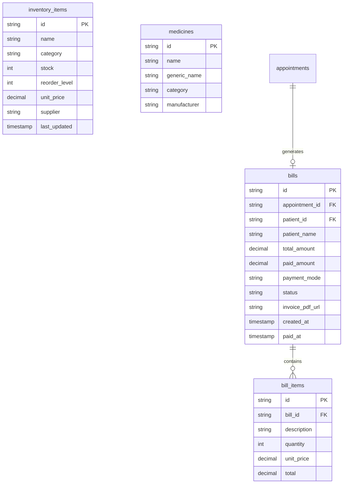
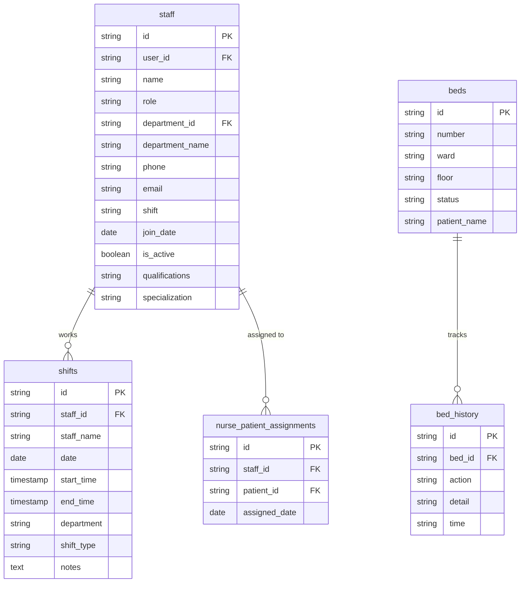

# MedNex — Entity Relationship Diagrams

> Accurate ER diagrams derived from the app's Swift data models.

---

## Complete ER Diagram

```mermaid
erDiagram
    users {
        string id PK
        string email
        string role "patient|doctor|admin|nurse|lab_technician|pharmacist|receptionist|accountant"
        string display_name
        string profile_image_url
        string phone_number
        timestamp created_at
        timestamp last_login
        boolean is_active
    }

    departments {
        string id PK
        string name
        string head_doctor_id FK
        string head_doctor_name
        int staff_count
        string location
        text description
        boolean is_active
        timestamp created_at
    }

    doctors {
        string id PK
        string user_id FK
        string name
        string specialty "18 specialties enum"
        int experience
        string license_number
        decimal consultation_fee
        string department_id FK
        double rating
        int total_ratings
        text bio
        string education
        boolean is_available
    }

    doctor_languages {
        string id PK
        string doctor_id FK
        string language
    }

    time_slots {
        string id PK
        string doctor_id FK
        date date
        timestamp start_time
        timestamp end_time
        boolean is_booked
    }

    patients {
        string id PK
        string user_id FK
        string first_name
        string last_name
        date date_of_birth
        string gender "male|female|other"
        string phone
        string address
        string city
        string state
        string zip_code
    }

    medical_info {
        string patient_id PK, FK
        string blood_type "A+|A-|B+|B-|AB+|AB-|O+|O-|Unknown"
        double height_cm
        double weight_kg
    }

    patient_allergies {
        string id PK
        string patient_id FK
        string allergy
    }

    patient_chronic_conditions {
        string id PK
        string patient_id FK
        string condition
    }

    patient_current_medications {
        string id PK
        string patient_id FK
        string medication
    }

    emergency_contacts {
        string id PK
        string patient_id FK
        string name
        string relationship
        string phone
    }

    appointments {
        string id PK
        string patient_id FK
        string patient_name
        string doctor_id FK
        string doctor_name
        string specialty
        timestamp date_time
        timestamp end_time
        string status "scheduled|in_progress|completed|cancelled|no_show"
        string type "consultation|follow_up|emergency|checkup|procedure"
        text notes
        string prescription_id FK
        string billing_status "pending|invoiced|paid|partially_paid|overdue|waived"
        string cancellation_reason
        timestamp created_at
    }

    prescriptions {
        string id PK
        string appointment_id FK
        string patient_id FK
        string patient_name
        string doctor_id FK
        string doctor_name
        string diagnosis
        text notes
        string pdf_url
        string status "active|completed|dispensed|partially_dispensed|cancelled"
        timestamp created_at
    }

    prescribed_medicines {
        string id PK
        string prescription_id FK
        string name
        string dosage
        string frequency "Once Daily|Twice Daily|Thrice Daily|Four Times Daily|As Needed|Weekly|Before Meals|After Meals|At Bedtime"
        string duration
        text instructions
        boolean is_taken
    }

    medicines {
        string id PK
        string name
        string generic_name
        string category
        string manufacturer
    }

    medicine_dosage_forms {
        string id PK
        string medicine_id FK
        string dosage_form
    }

    medicine_strengths {
        string id PK
        string medicine_id FK
        string strength
    }

    bills {
        string id PK
        string appointment_id FK
        string patient_id FK
        string patient_name
        decimal total_amount
        decimal paid_amount
        string payment_mode "cash|card|insurance|upi|bank_transfer"
        string status "unpaid|paid|partial|overdue|waived"
        string invoice_pdf_url
        timestamp created_at
        timestamp paid_at
    }

    bill_items {
        string id PK
        string bill_id FK
        string description
        int quantity
        decimal unit_price
        decimal total
    }

    lab_tests {
        string id PK
        string patient_id FK
        string patient_name
        string doctor_id FK
        string doctor_name
        string test_name
        string test_category "Blood Work|Urinalysis|Imaging|Biopsy|Cardiology|Microbiology|Hormonal|Genetic|Other"
        string status "pending|received|processing|completed|cancelled"
        string priority "routine|urgent|stat"
        text notes
        string report_pdf_url
        timestamp ordered_at
        timestamp completed_at
    }

    lab_test_results {
        string id PK
        string lab_test_id FK
        string parameter_name
        string value
        string unit
        string normal_range
        boolean is_abnormal
    }

    vital_records {
        string id PK
        string patient_id FK
        string recorded_by
        timestamp timestamp
        double bp_systolic
        double bp_diastolic
        double heart_rate
        double temperature_f
        double respiratory_rate
        double oxygen_saturation
        double weight_kg
        double height_cm
        double blood_glucose
        text notes
    }

    staff {
        string id PK
        string user_id FK
        string name
        string role "patient|doctor|admin|nurse|lab_technician|pharmacist|receptionist|accountant"
        string department_id FK
        string department_name
        string phone
        string email
        string shift "Morning|Evening|Night"
        date join_date
        boolean is_active
        string qualifications
        string specialization
    }

    shifts {
        string id PK
        string staff_id FK
        string staff_name
        date date
        timestamp start_time
        timestamp end_time
        string department
        string shift_type "Morning|Evening|Night"
        text notes
    }

    inventory_items {
        string id PK
        string name
        string category "Medication|Equipment|Consumables|Lab Supplies|Surgical|Other"
        int stock
        int reorder_level
        decimal unit_price
        string supplier
        timestamp last_updated
    }

    beds {
        string id PK
        string number
        string ward
        string floor
        string status "available|occupied|reserved|cleaning|maintenance"
        string patient_name
    }

    bed_history {
        string id PK
        string bed_id FK
        string action
        string detail
        string icon
        string color
        string time
    }

    notifications {
        string id PK
        string user_id FK
        string type "appointment_booked|appointment_reminder|appointment_cancelled|lab_result_ready|prescription_ready|payment_due|shift_assigned|general"
        string title
        text body
        boolean is_read
        string related_id
        timestamp created_at
    }

    chat_sessions {
        string id PK
        string patient_id FK
        timestamp created_at
        timestamp updated_at
    }

    chat_messages {
        string id PK
        string session_id FK
        string role "user|assistant|system"
        text content
        timestamp timestamp
        string suggested_specialty
        string urgency_level "low|moderate|high|emergency"
    }

    nurse_patient_assignments {
        string id PK
        string staff_id FK
        string patient_id FK
        date assigned_date
    }

    users ||--o| patients : "has profile"
    users ||--o| doctors : "has profile"
    users ||--o| staff : "has profile"
    users ||--o{ notifications : "receives"

    departments ||--o{ doctors : "employs"
    departments ||--o{ staff : "employs"

    doctors ||--o{ time_slots : "has availability"
    doctors ||--o{ doctor_languages : "speaks"
    doctors ||--o{ appointments : "attends"
    doctors ||--o{ prescriptions : "writes"
    doctors ||--o{ lab_tests : "orders"

    patients ||--|| medical_info : "has"
    patients ||--o{ patient_allergies : "has"
    patients ||--o{ patient_chronic_conditions : "has"
    patients ||--o{ patient_current_medications : "takes"
    patients ||--o{ emergency_contacts : "has"
    patients ||--o{ appointments : "books"
    patients ||--o{ prescriptions : "receives"
    patients ||--o{ bills : "owes"
    patients ||--o{ lab_tests : "undergoes"
    patients ||--o{ vital_records : "has"
    patients ||--o{ chat_sessions : "starts"
    patients ||--o{ nurse_patient_assignments : "assigned to"

    appointments ||--o| prescriptions : "generates"
    appointments ||--o| bills : "generates"

    prescriptions ||--o{ prescribed_medicines : "contains"

    medicines ||--o{ medicine_dosage_forms : "available in"
    medicines ||--o{ medicine_strengths : "available in"

    bills ||--o{ bill_items : "contains"

    lab_tests ||--o{ lab_test_results : "produces"

    staff ||--o{ shifts : "works"
    staff ||--o{ nurse_patient_assignments : "assigned to"

    beds ||--o{ bed_history : "tracks"

    chat_sessions ||--o{ chat_messages : "contains"
```



---

## Diagram by Domain

### 1. User & Authentication



### 2. Patient Domain

```mermaid
erDiagram
    patients {
        string id PK
        string user_id FK
        string first_name
        string last_name
        date date_of_birth
        string gender
        string phone
        string address
        string city
        string state
        string zip_code
    }

    medical_info {
        string patient_id PK_FK
        string blood_type
        double height_cm
        double weight_kg
    }

    emergency_contacts {
        string id PK
        string patient_id FK
        string name
        string relationship
        string phone
    }

    patient_allergies {
        string id PK
        string patient_id FK
        string allergy
    }

    patient_chronic_conditions {
        string id PK
        string patient_id FK
        string condition
    }

    patient_current_medications {
        string id PK
        string patient_id FK
        string medication
    }

    vital_records {
        string id PK
        string patient_id FK
        string recorded_by
        timestamp timestamp
        double bp_systolic
        double bp_diastolic
        double heart_rate
        double temperature_f
        double respiratory_rate
        double oxygen_saturation
        double weight_kg
        double height_cm
        double blood_glucose
        text notes
    }

    patients ||--|| medical_info : "has"
    patients ||--o{ emergency_contacts : "has"
    patients ||--o{ patient_allergies : "has"
    patients ||--o{ patient_chronic_conditions : "has"
    patients ||--o{ patient_current_medications : "takes"
    patients ||--o{ vital_records : "has"
```

### 3. Doctor & Scheduling Domain



### 4. Clinical Workflow Domain



### 5. Billing & Inventory Domain



### 6. Staff & Operations Domain


